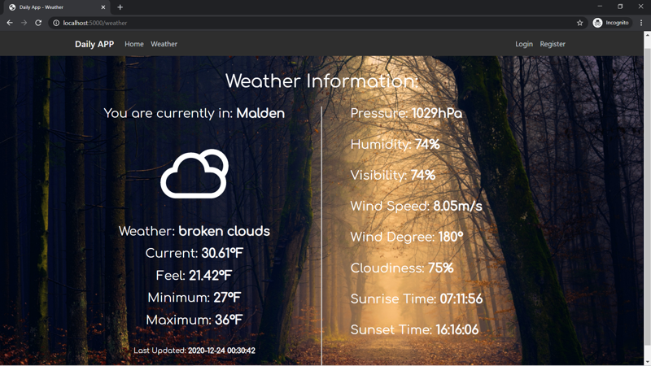

# Daily APP

Hi there, thanks for having an interest in daily app. It is still under development, but you are more than welcome to try it out! 

## What can it do (currently) ?
1. Home page that shows you current time

2. Weather page that shows weather in your location (zip setting functionality comming soon)


## What other functionality are comming ?
You can always check [todo.md](./todo.md)
1. User settings (including custom name, zip code for weather, etc.)
2. Diary page! A place where you can write a diary entry every day.

## To run on your local machine:
1. You'll need to create a folder inside the [images](./dailyapp/images) called wallpapers and fill it with 11 wallpapers.
2. Or, alternatively, you can change the get_image() method in [routes.py](./dailyapp/routes.py) to return an empty string or a link to any image you want.
3. For the program to run, you will also need to initiate a database. It is easy, just copy the code below and run on local python terminal.
```python
from dailyapp import db
db.create_all()
```
4. For the weather page, it defaults to show weather from Malden MA(zip=02148), you can change zip code to whatever you want (in the US only, sorry) in [weather.py](./dailyapp/weather.py)

## Credits:
Special thanks to [open weather map](https://openweathermap.org) for providing free weather api and to the developer(s) behind Flask for creating such an easy-to-use web framework. Also to [weather icons](https://github.com/erikflowers/weather-icons) for providing the open-source weather icon used in this app.